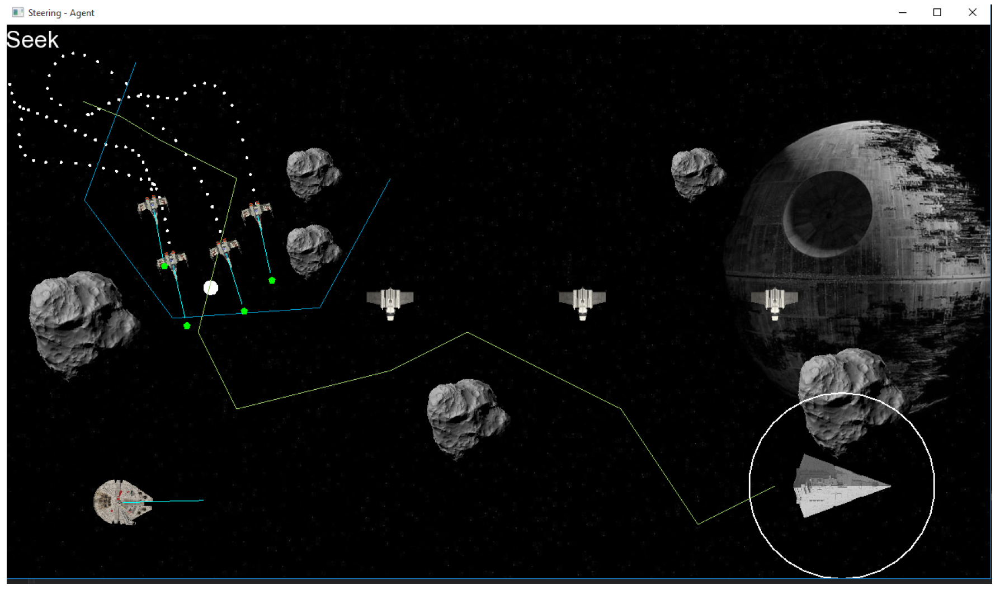
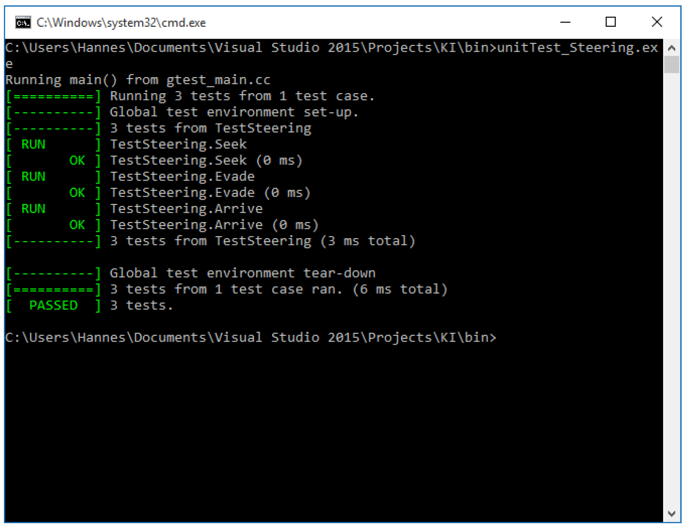

# steering-behaviors
Different steering behaviors visualized using SFML 2.3.2 (https://www.sfml-dev.org).

## Game

## Controls

Input    |   Control element
---------|------------------
LMB      | set target to mouse position (star destroyer)
[F]      | Flee ! Millenium Falcon init
[S]      | Seek ! Millenium Falcon init
[A]      | Arrive ! Millenium Falcon init
[W]      | Wander ! Millenium Falcon init
[P]      | Pursue ! Millenium Falcon init
[E]      | Evade ! Millenium Falcon init
[B]      | Follow Path ! Millenium Falcon init

## Unit Test

## Tasks

### Input

Steering Behaviors:
1. Ray Casting with Center Ray + Whiskers
2. relevant vectors visible
3. Trajectory of objects visible
4. draw each entity (target, obstacle, etc.) 
Group Behaviors:
1. 4 NPCs in Wedge Formation
2. Formation follows anker point with a fixed path
3. Priority Blending + Moderation
4. rectangle obstacles
5. 3 generic agents which are in conflict with the path

